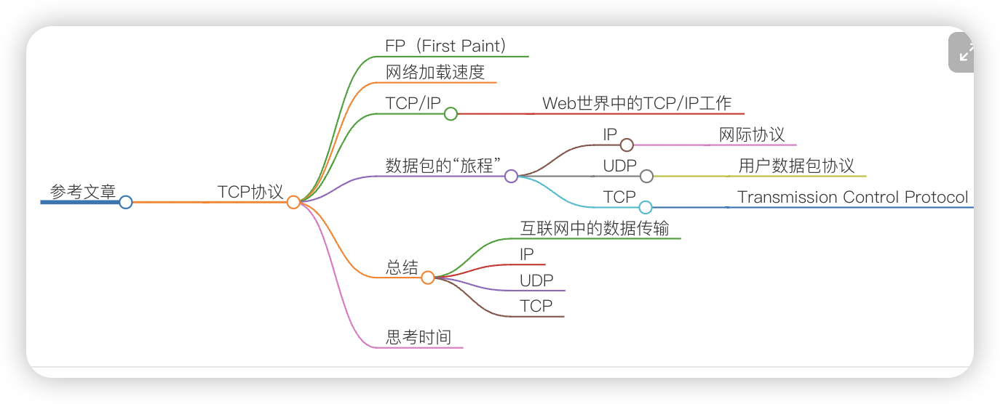
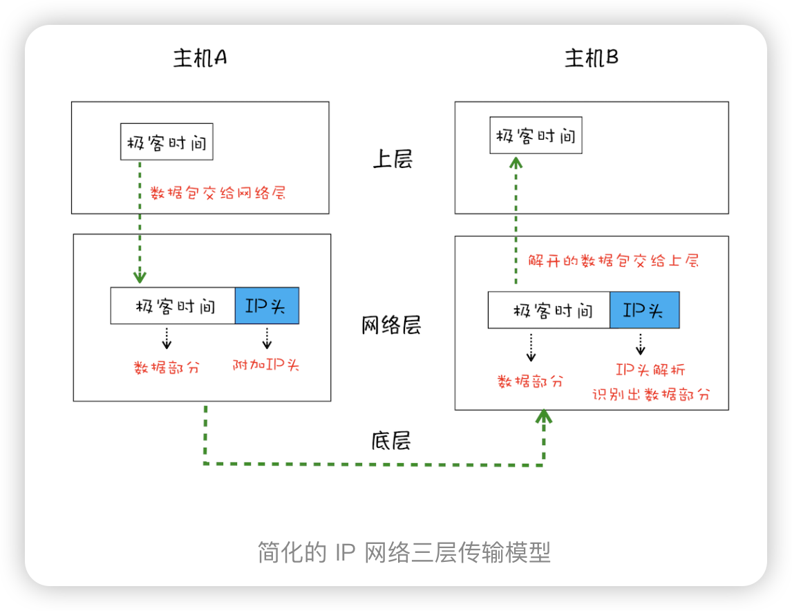
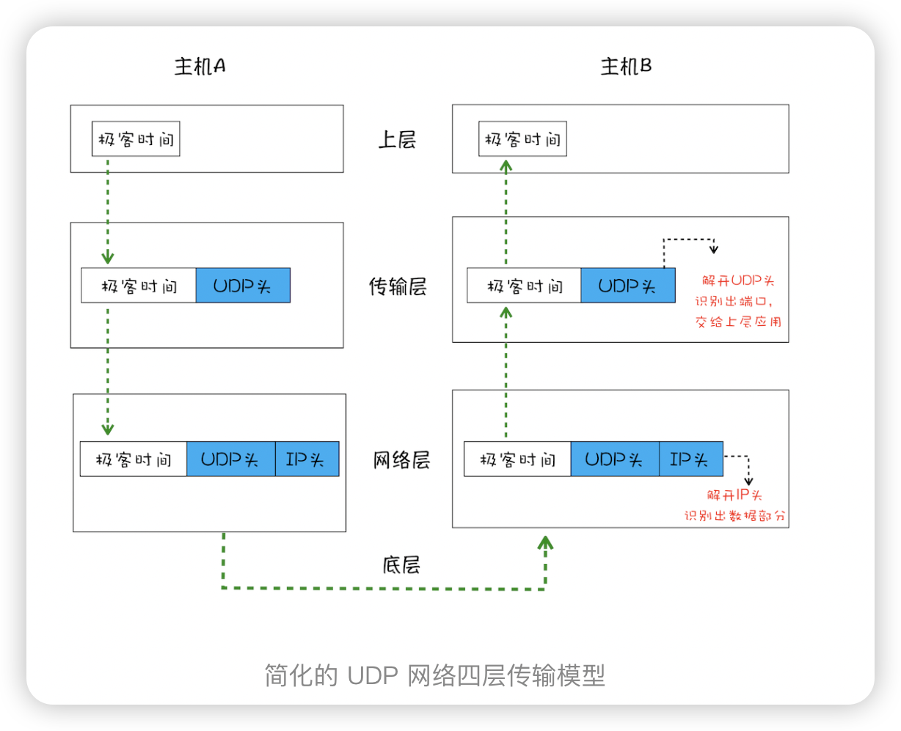
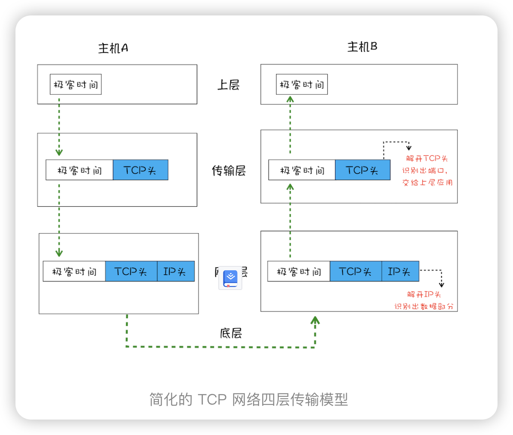
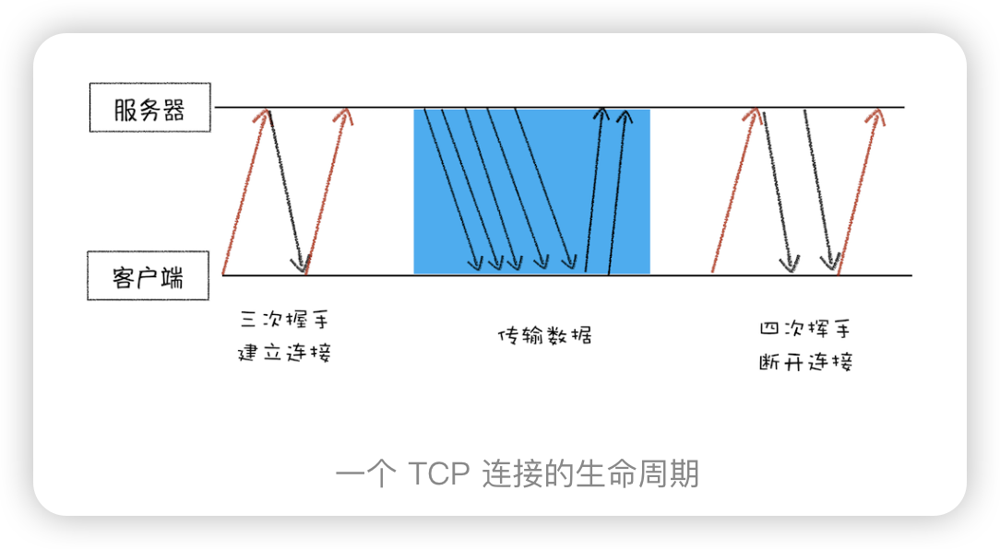

> 如何保证页面文件能被完整送达浏览器？ 一个数据包的旅程

衡量 Web 页面性能的时候有一个重要的指标叫“FP（First Paint）”，是指从页面加载到首次开始绘制的时长；
那什么影响 FP 指标呢？其中一个重要的因素是网络加载速度。

“数据包如何送达主机” IP 网际协议（Internet Protocol
“主机如何将数据包转交给应用” UDP 用户数据包协议（User Datagram Protocol）
“数据是如何被完整地送达应用程序” TCP  传输控制协议
这三个角度来为你讲述数据的传输过程。
## IP 把数据包送达目的主机
计算机的地址就称为 IP 地址，访问任何网站实际上只是你的计算机向另外一台计算机请求信息。
IP 头是 IP 数据包开头的信息，包含 IP 版本、源 IP 地址、目标 IP 地址、生存时间等信息

## UDP 用户数据包协议 把数据包送达应用程序
IP 是非常底层的协议，只负责把数据包传送到对方电脑，但是对方电脑并不知道把数据包交给哪个程序
因此，需要基于 IP 之上开发能和应用打交道的协议，最常见的是“用户数据包协议（User Datagram Protocol）”，简称 UDP。
端口号：就是一个数字，每个想访问网络的程序都需要绑定一个端口号。通过端口号 UDP 就能把指定的数据包发送给指定的程序了，所以 IP 通过 IP 地址信息把数据包发送给指定的电脑，而 UDP 通过端口号把数据包分发给正确的程序。

UDP 头再和原始数据包合并组成新的 UDP 数据包。UDP 头中除了目的端口，还有源端口号等信息。

问题：
- 在使用 UDP 发送数据时，有各种因素会导致数据包出错， 丢包
- UDP 在发送之后也无法知道是否能达到目的地。

## TCP 传输控制协议 把数据完整地送达应用程序

UDP问题：
- 数据包在传输过程中容易丢失；
- 大文件会被拆分成很多小的数据包来传输，这些小的数据包会经过不同的路由，并在不同的时间到达接收端，而 UDP 协议并不知道如何组装这些数据包，从而把这些数据包还原成完整的文件。
  
  所以就有了  TCP（Transmission Control Protocol，传输控制协议）是一种面向连接的、可靠的、基于字节流的传输层通信协议。

  特点:
  - 对于数据包丢失的情况，TCP 提供重传机制；
  - TCP 引入了数据包排序机制，用来保证把乱序的数据包组合成一个完整的文件。
  TCP 头除了包含了目标端口和本机端口号外，还提供了用于排序的序列号，以便接收端通过序号来重排数据包。

完整的 TCP 连接过程，通过这个过程你可以明白 TCP 是如何保证重传机制和数据包的排序功能的。
一个完整的 TCP 连接的生命周期包括了“建立连接”“传输数据”和“断开连接”三个阶段。

- 首先，建立连接阶段。这个阶段是通过“三次握手”来建立客户端和服务器之间的连接。TCP 提供面向连接的通信传输。面向连接是指在数据通信开始之前先做好两端之间的准备工作。所谓三次握手，是指在建立一个 TCP 连接时，客户端和服务器总共要发送三个数据包以确认连接的建立。
-  其次，传输数据阶段。在该阶段，接收端需要对每个数据包进行确认操作，也就是接收端在接收到数据包之后，需要发送确认数据包给发送端。所以当发送端发送了一个数据包之后，在规定时间内没有接收到接收端反馈的确认消息，则判断为数据包丢失，并触发发送端的重发机制。同样，一个大的文件在传输过程中会被拆分成很多小的数据包，这些数据包到达接收端后，接收端会按照 TCP 头中的序号为其排序，从而保证组成完整的数据。
-  最后，断开连接阶段。数据传输完毕之后，就要终止连接了，涉及到最后一个阶段“四次挥手”来保证双方都能断开连接。
  

总结
1. 互联网中的数据是通过数据包来传输的，数据包在传输过程中容易丢失或出错。
2. IP 负责把数据包送达目的主机。
3. UDP 负责把数据包送达具体应用。
4. 而 TCP 保证了数据完整地传输，它的连接可分为三个阶段：建立连接、传输数据和断开连接。
