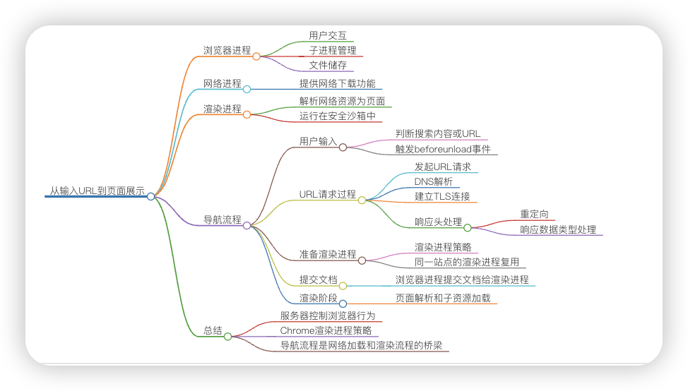
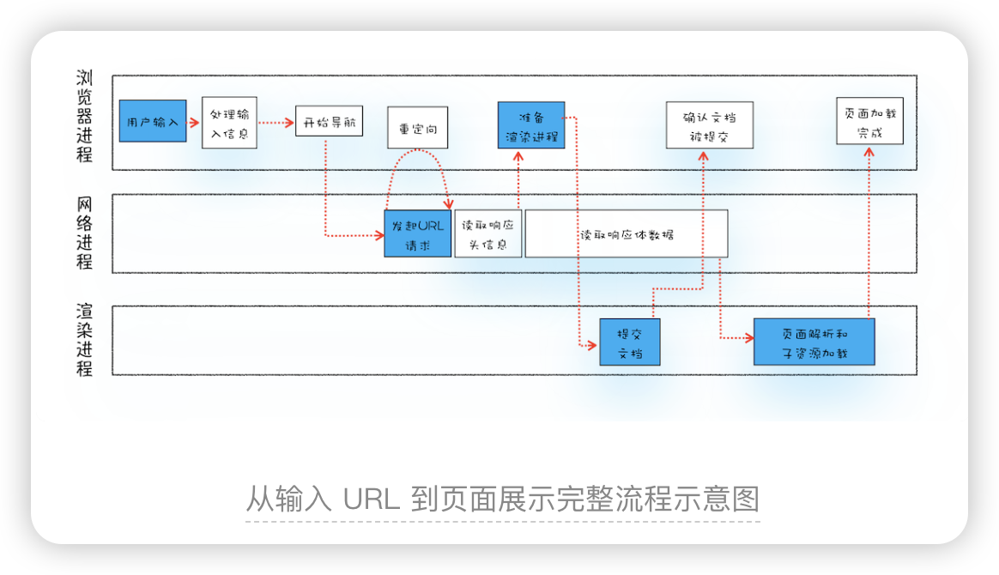

> 从输入URL到页面展示，这中间发生了什么？

在浏览器里，从输入 URL 到页面展示，这中间发生了什么？

1. 用户输入关键词，地址栏判断是搜索内容还是url地址。
如果是搜索内容，会使用浏览器默认搜索引擎加上搜索内容合成url；
如果是域名会加上协议（如https）合成完整的url。

2. 然后按下回车。浏览器进程通过IPC（进程间通信）把url传给网络进程（网络进程接收到url才发起真正的网络请求）。

3. 网络进程接收到url后，先查找有没有缓存。
有缓存，直接返回缓存的资源。
没有缓存。（进入真正的网络请求）。首先获取域名的IP，系统会首先自动从hosts文件中寻找域名对应的 IP 地址，一旦找到，和服务器建立TCP连接；如果没有找到，则系统会将网址提交 DNS 域名解析服务器进行 IP 地址的解析。

4. 利用IP地址和服务器建立TCP连接（3次握手）。

5. 建立连接后，浏览器构建数据包（包含请求行，请求头，请求正文，并把该域名相关Cookie等数据附加到请求头），然后向服务器发送请求消息。

6. 服务器接收到消息后根据请求信息构建响应数据（包括响应行，响应头，响应正文），然后发送回网络进程。

7. 网络进程接收到响应数据后进行解析。
如果发现响应行的返回的状态码为301，302，说明服务器要我们去找别人要数据，找谁呢？找响应头中的Location字段要，Location的内容是需要重定向的地址url。获取到这个url一切重新来过。
如果返回的状态码为200，说明服务器返回了数据。

8. 好了，获取到数据以什么方式打开呢？打开的方式不对的话也不行。打开的方式就是 Content-Type。这个属性告诉浏览器服务器返回的数据是什么类型的。如果返回的是网页类型则为 text/html，如果是下载文件类型则为 application/octet-stream 等等。打开的方式不对，则得到的结果也不对。    
如果是下载类型，则该请求会被提交给浏览器的下载管理器，同时该请求的流程到此结束。
如果是网页类型，那么浏览器就要准备渲染页面了。

9. 渲染页面开始。浏览器进程发出“提交文档”（文档是响应体数据）消息给渲染进程，渲染进程接收到消息后会和网络进程建立传输数据的通道，网络进程将“文档”传输给渲染进程。

10. 一旦开始传输，渲染进程便开始渲染界面（详细渲染过程待续。。。）

11. 传输完毕，渲染进程会发出“确认提交”消息给浏览器进程。

12. 浏览器在接收到“确认提交”消息后，更新浏览器界面状态（包括地址栏信息，仟前进后退历史，web页面和网站安全状态）。

13. 页面此时可能还没有渲染完毕，而一旦渲染完毕，渲染进程会发送一个消息给浏览器进程，浏览器接收到这个消息后会停止标签图标的加载动画。

自此，一个完整的页面形成了。

问题1
浏览器的http的keepalive的connection是什么粒度复用的呢？也是域名加协议头级别吗？
首先keep-alive是为了解决连接效率不高的问题，http1.0时代，http请求都是短连接的形式，也即是每次请求一个资源都需要和服务器建立连接+传输数据+断开连接，通常，建立连接和断开连接的时间就有可能超过传输数据的时间了，这种短连接的效率是异常的低效。

针对短连接低效的问题，后面就出现了长连接，也就是这里要讲的keep-alive。

你可以把长连接看成是一个管道，一个http请求结束之后，不会关闭连接，下个请求可以复用该连接，这样就省去建立连接和断开连接的时间了，但是他们请求是按照顺序，也就是符合IP+端口规则的资源都可以复用该连接，这就回答了上面提的这个问题。

但是，使用keep-alive同样存在问题，比如一个页面可能有100张图片素材，假设这些图片素材都保存在同一个域名下面，如果只复用一个http管道的话，那么传输100张图片的素材也是非常耗时间的，这就出现了同一时刻并发连接服务器的需求，也就是文中提到同一时刻，对同一域名下面，只能可以发起6个请求，这样就可以大大提升请求效率了。

为什么是6个请求而不是更多了，这是为了服务器性能考虑，如果同一时刻无限制连接，那么可能会导致服务器忙不过来。

问题2
同一站点共用一个渲染进程，那假设有2个标签页是同一站点，我在A标签页面写个死循环，导致页面卡死，B页面是否也是卡死了呢？

多个页面公用一个渲染进程，也就意味着多个页面公用同一个主线程，所有页面的任务都是在同一个主线程上执行，这些任务包括渲染流程，JavaScript执行，用户交互的事件的响应等等，@@@但是@@@  如果一个标签页里面执行一个死循环，那么意味着该JavaScript代码会一直霸占主线程，这样就导致了其它的页面无法使用该主线程，从而让所有页面都失去响应！