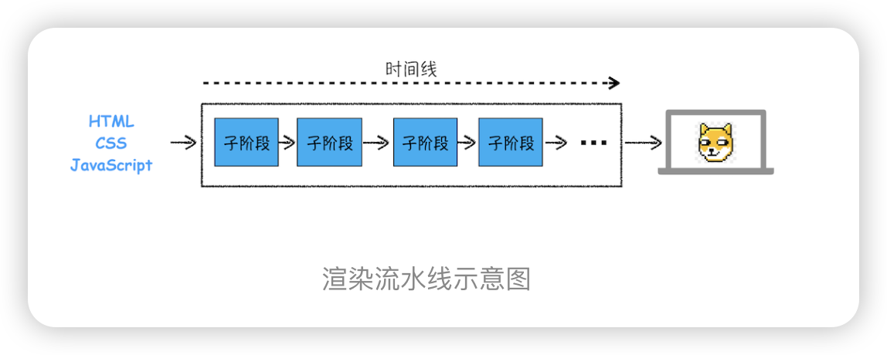
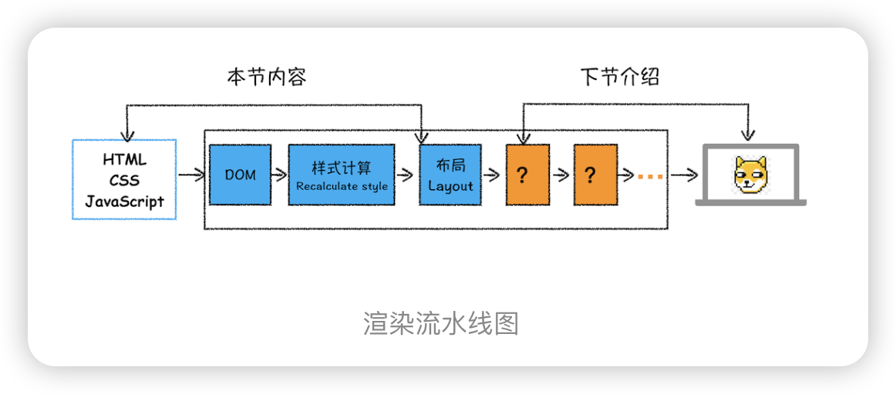
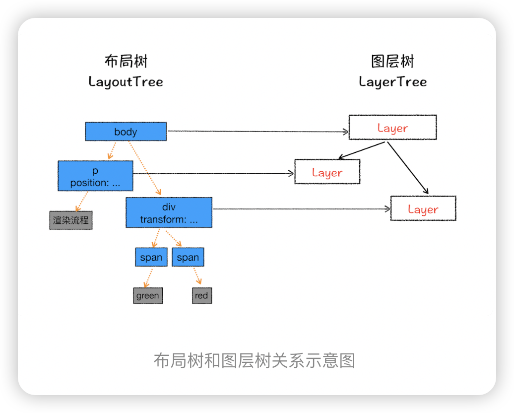
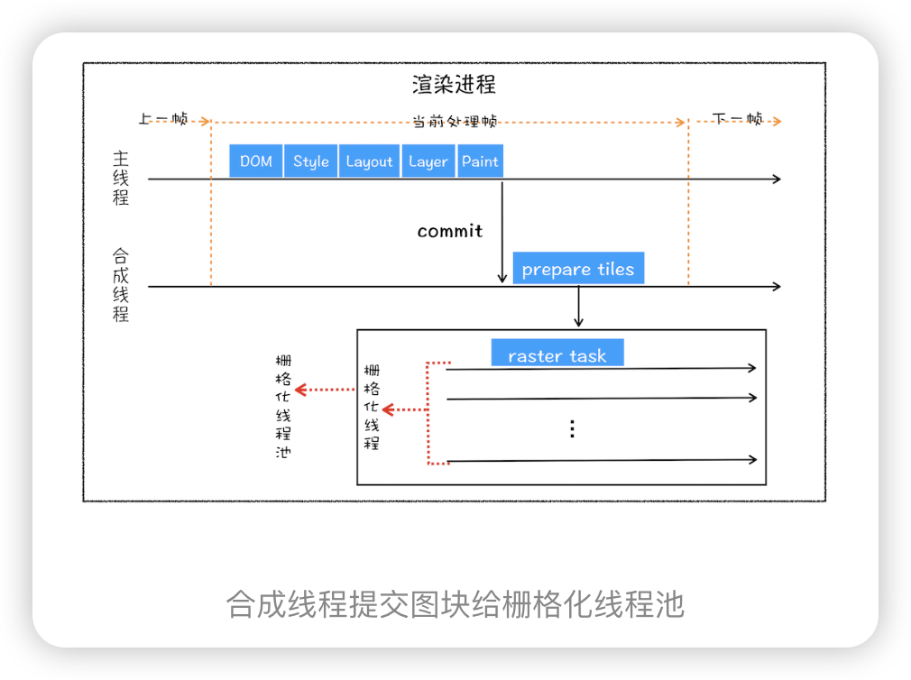
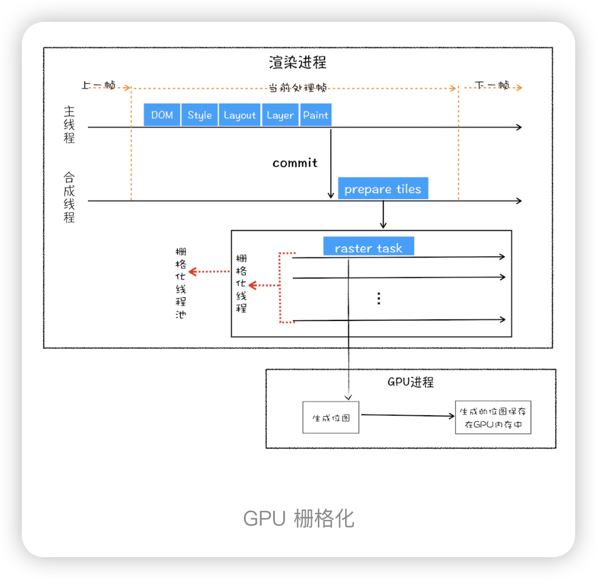

>HTML、CSS和JavaScript，是如何变成页面的？

按照渲染的时间顺序，流水线可分为如下几个子阶段：构建 DOM 树、样式计算、布局阶段、分层、绘制、分块、光栅化和合成。内容比较多，我会用两篇文章来为你详细讲解这各个子阶段。接下来，在介绍每个阶段的过程中，你应该重点关注以下三点内容：
- 开始每个子阶段都有其输入的内容；
- 然后每个子阶段有其处理过程；
- 最终每个子阶段会生成输出内容。

- 浏览器不能直接理解 HTML 数据，所以第一步需要将其转换为浏览器能够理解的 DOM 树结构；
- 生成 DOM 树后，还需要根据 CSS 样式表，来计算出 DOM 树所有节点的样式；
- 最后计算 DOM 元素的布局信息，使其都保存在布局树中。
## 构建 DOM 树
  **输入**：html、CSS JS
  **处理**：由 HTML 解析器解析
  **输出**：DOM树

## 样式计算
 **输入**： link 引用的外部 CSS 文件， link 引用的外部 CSS 文件，元素的 style 属性内嵌的 CSS
  **处理**： 转换为styleSheet， 属性值标准化，计算出DOM树中每个节点具体样式， 样式计算阶段的目的是为了计算出 DOM 节点中每个元素的具体样式，在计算过程中需要遵守 CSS 的继承和层叠两个规则
  **输出**： 每个 DOM 节点的样式，并被保存在 ComputedStyle 的结构内。

## 布局阶段
需要计算出 DOM 树中可见元素的几何位置，我们把这个计算过程叫做布局。
 **输入**：
  **处理**：
  **输出**：

## 分层
**输入**布局树
**处理**
 渲染引擎还需要为特定的节点生成专用的图层，并生成一棵对应的图层树（LayerTree）
 
 并不是布局树的每个节点都包含一个图层，如果一个节点没有对应的层，那么这个节点就从属于父节点的图层。
那么需要满足什么条件，渲染引擎才会为特定的节点创建新的图层呢？通常满足下面两点中任意一点的元素就可以被提升为单独的一个图层。
1. 拥有[层叠上下文](https://developer.mozilla.org/zh-CN/docs/Web/CSS/CSS_positioned_layout/Understanding_z-index/Stacking_context)属性的元素会被提升为单独的一层。
2. 需要剪裁（clip）的地方也会被创建为图层。
 **输出** 图层树

## 图层绘制
  **输入**：图层树
  **处理**： 把一个图层的绘制拆分成很多小的绘制指令，然后再把这些指令按照顺序组成一个待绘制列表
  **输出**： 待绘制列表
 
## 栅格化操作
  **输入**： 绘制列表（绘制顺序和绘制指令）
  **处理**：渲染进程中 的主线程 合成线程会将图层划分为图块（tile），这些图块的大小通常是 256x256 或者 512x512， 实际就说 图块 转换为 位图； 合成线程会按照视口附近的图块来优先生成位图，实际生成位图的操作是由栅格化来执行的；栅格化过程都会使用 GPU 来加速生成，使用 GPU 生成位图的过程叫快速栅格化，或者 GPU 栅格化，生成的位图被保存在 GPU 内存中
  **输出**：位图

## 合成显示
  ### 合成 
  **输入**：光栅化后生成的位图
  **处理**：渲染引擎中的合成线程 生成 一个绘制图块命令（DrawQuad）
  **输出**：DrawQuad 提交给浏览器
  ### 显示
  **输入**：DrawQuad 命令
  **处理**： 页面绘制到内存中
  **输出**： 将内存显示到屏幕中
 
减少重排重绘, 方法很多：
1. 使用 class 操作样式，而不是频繁操作 style
2. 避免使用 table 布局
3. 批量dom 操作，例如 createDocumentFragment，或者使用框架，例如 React
4. Debounce window resize 事件
5. 对 dom 属性的读写要分离 
6. will-change: 让浏览器创建层，transform 做优化 
7. 虽然通过分层可以优化浏览器性能，但并不意味着应该给每个元素一个层，过多的层反而影响性能，所以在层的划分上应该具体形况具体分析。

