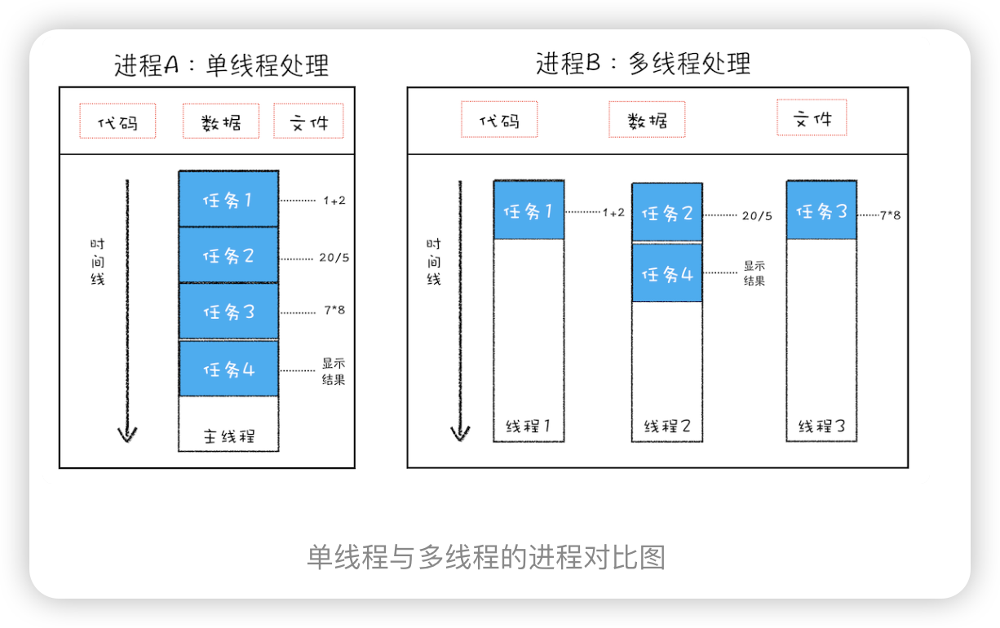
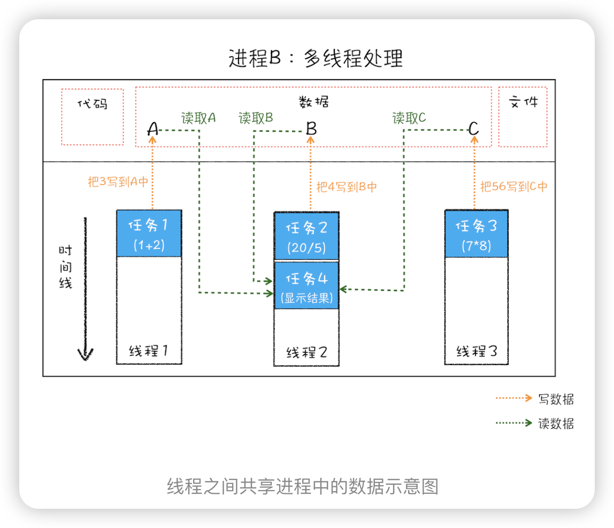
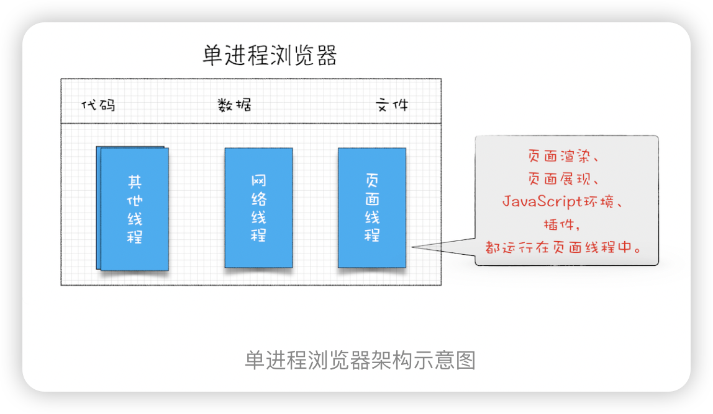
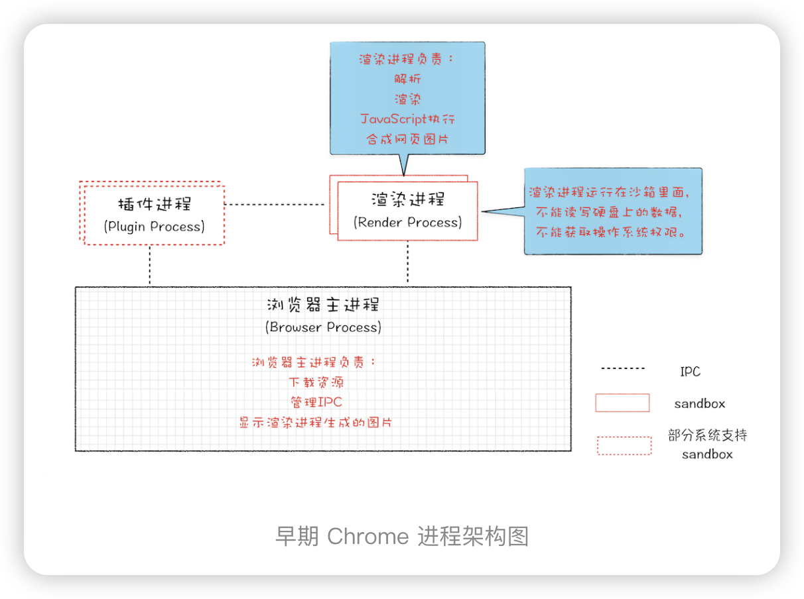
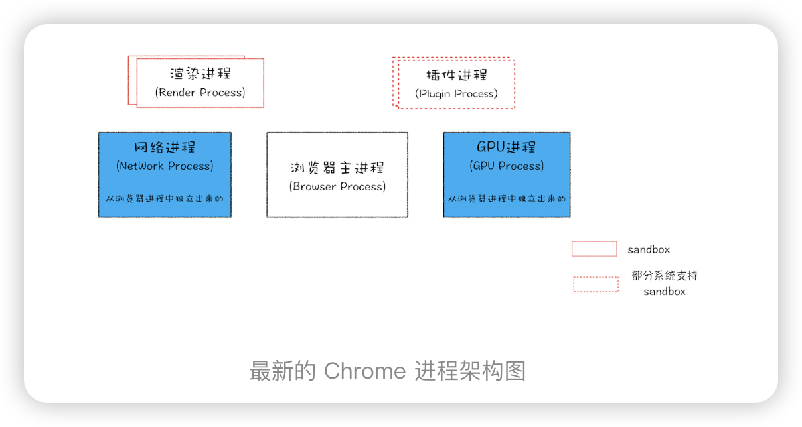
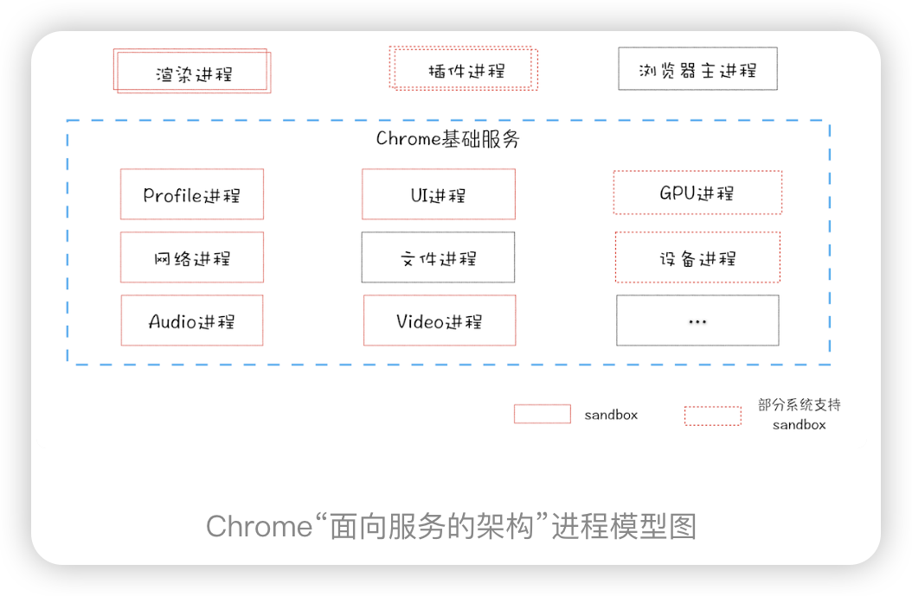
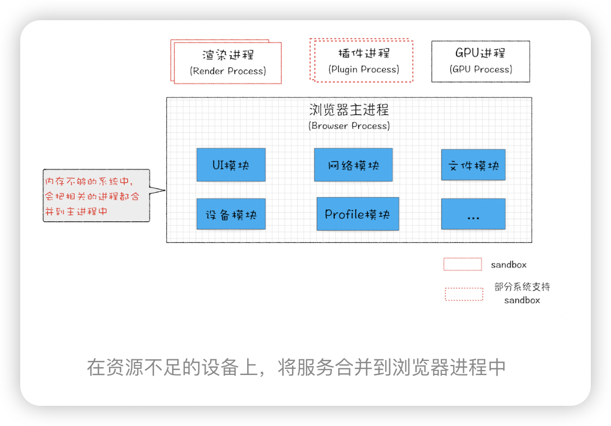

### 什么是并行处理
    计算机中的并行处理就是同一时刻处理多个任务
    多线程可以并行处理任务，但是线程是不能单独存在的，它是由进程来启动和管理的。那什么又是进程呢？
   
## 进程
 一个进程就是一个程序的运行实例。详细解释就是，启动一个程序的时候，操作系统会为该程序创建一块内存，用来存放代码、运行中的数据和一个执行任务的主线程，我们把这样的一个运行环境叫进程。

## 进程和线程关系
多线程可以并行处理任务，但是线程是不能单独存在的，它是由进程来启动和管理的。那什么又是进程呢？

**线程是依附于进程的，而进程中使用多线程并行处理能提升运算效率**

**特点**
1. 进程中的任意一线程执行出错，都会导致整个进程的崩溃。
2. 线程之间共享进程中的数据。
   

3. 当一个进程关闭之后，操作系统会回收进程所占用的内存。
   当一个进程退出时，操作系统会回收该进程所申请的所有资源；即使其中任意线程因为操作不当导致内存泄漏，当进程退出时，这些内存也会被正确回收。

4. 进程之间的内容相互隔离。
   进程隔离是为保护操作系统中进程互不干扰的技术，每一个进程只能访问自己占有的数据，
   正是因为进程之间的数据是严格隔离的，所以一个进程如果崩溃了，或者挂起了，是不会影响到其他进程的。如果进程之间需要进行数据的通信，这时候，就需要使用用于进程间通信（IPC）的机制了。

 ## 发展
 **单进程浏览器时代**
 单进程浏览器是指浏览器的所有功能模块都是运行在同一个进程里，这些模块包含了网络、插件、JavaScript 运行环境、渲染引擎和页面等。其实早在 2007 年之前，市面上浏览器都是单进程的。单进程浏览器的架构如下图所示：

**问题**
如此多的功能模块运行在一个进程里，是导致单进程浏览器**不稳定**、**不流畅**和**不安全**的一个主要因素。

1. 问题1 不稳定
    早期浏览器需要借助于插件来实现诸如 Web 视频、Web 游戏等各种强大的功能，但是插件是最容易出问题的模块，并且还运行在浏览器进程之中，所以一个插件的意外崩溃会引起整个浏览器的崩溃。
    渲染引擎模块也是不稳定的，通常一些复杂的 JavaScript 代码就有可能引起渲染引擎模块的崩溃。和插件一样，渲染引擎的崩溃也会导致整个浏览器的崩溃。

2. 问题 2：不流畅
    脚本或者插件会让单进程浏览器变卡顿
    **页面的内存泄漏**也是单进程变慢的一个重要原因。通常浏览器的内核都是非常复杂的，运行一个复杂点的页面再关闭页面，会存在内存不能完全回收的情况，这样导致的问题是使用时间越长，内存占用越高，浏览器会变得越慢。
3.  问题 3：不安全
    插件和页面脚本两个方面来解释该原因
    插件可以使用 C/C++ 等代码编写，通过插件可以获取到操作系统的任意资源，当你在页面运行一个插件时也就意味着这个插件能完全操作你的电脑。如果是个恶意插件，那么它就可以释放病毒、窃取你的账号密码，引发安全性问题。
    至于页面脚本，它可以通过浏览器的漏洞来获取系统权限，这些脚本获取系统权限之后也可以对你的电脑做一些恶意的事情，同样也会引发安全问题。

## 多进程浏览器时代
 ### 早期多进程架构
 
 **我们先看看如何解决不稳定的问题**。由于进程是相互隔离的，所以当一个页面或者插件崩溃时，影响到的仅仅是当前的页面进程或者插件进程，并不会影响到浏览器和其他页面，这就完美地解决了页面或者插件的崩溃会导致整个浏览器崩溃，也就是不稳定的问题。

 **看看不流畅的问题是如何解决的**。同样，JavaScript 也是运行在渲染进程中的，所以即使 JavaScript 阻塞了渲染进程，影响到的也只是当前的渲染页面，而并不会影响浏览器和其他页面，因为其他页面的脚本是运行在它们自己的渲染进程中的。所以当我们再在 Chrome 中运行上面那个死循环的脚本时，没有响应的仅仅是当前的页面。对于内存泄漏的解决方法那就更简单了，因为当关闭一个页面时，整个渲染进程也会被关闭，之后该进程所占用的内存都会被系统回收，这样就轻松解决了浏览器页面的内存泄漏问题。

 疑问？ 内存是怎么被回收？？回收机制、回收流程

**最后我们再来看看上面的两个安全问题是怎么解决的**。采用多进程架构的额外好处是可以使用**安全沙箱**，你可以把沙箱看成是操作系统给进程上了一把锁，沙箱里面的程序可以运行，但是不能在你的硬盘上写入任何数据，也不能在敏感位置读取任何数据，例如你的文档和桌面。Chrome 把插件进程和渲染进程锁在沙箱里面，这样即使在渲染进程或者插件进程里面执行了恶意程序，恶意程序也无法突破沙箱去获取系统权限。

### 目前多进程架构

**进程的功能**：
- 浏览器进程： 主要负责界面显示、用户交互、子进程管理，同时提供存储等功能。

- 渲染进程：核心任务是将 HTML、CSS 和 JavaScript 转换为用户可以与之交互的网页，排版引擎 Blink 和 JavaScript 引擎 V8 都是运行在该进程中，默认情况下，Chrome 会为每个 Tab 标签创建一个渲染进程。出于安全考虑，渲染进程都是运行在沙箱模式下。

- GPU进程：其实，Chrome 刚开始发布的时候是没有 GPU 进程的。而 GPU 的使用初衷是为了实现 3D CSS 的效果，只是随后网页、Chrome 的 UI 界面都选择采用 GPU 来绘制，这使得 GPU 成为浏览器普遍的需求。最后，Chrome 在其多进程架构上也引入了 GPU 进程。

- 网络进程：主要负责页面的网络资源加载，之前是作为一个模块运行在浏览器进程里面的，直至最近才独立出来，成为一个单独的进程。

- 插件进程：主要是负责插件的运行，因插件易崩溃，所以需要通过插件进程来隔离，以保证插件进程崩溃不会对浏览器和页面造成影响。

多进程缺点
**更高的资源占用**。因为每个进程都会包含公共基础结构的副本（如 JavaScript 运行环境），这就意味着浏览器会消耗更多的内存资源。
**更复杂的体系架构**。浏览器各模块之间耦合性高、扩展性差等问题，会导致现在的架构已经很难适应新的需求了。

### 未来面向服务的架构
（Services Oriented Architecture，简称 SOA）的

原来的各种模块会被重构成独立的服务（Service），每个服务（Service）都可以在独立的进程中运行，访问服务（Service）必须使用定义好的接口，通过 IPC 来通信，从而构建一个更内聚、松耦合、易于维护和扩展的系统，更好实现 Chrome 简单、稳定、高速、安全的目标

Chrome 最终要把 UI、数据库、文件、设备、网络等模块重构为基础服务，类似操作系统底层服务，下面是 Chrome“面向服务的架构”的进程模型图：

同时 Chrome 还提供灵活的弹性架构，在强大性能设备上会以多进程的方式运行基础服务，但是如果在资源受限的设备上（如下图），Chrome 会将很多服务整合到一个进程中，从而节省内存占用。

疑问：用通俗地话讲一下 什么是渲染：渲染就是：html，css，JS 变成页面的过程.

疑问： 即使是如今的多进程架构，我偶尔还会碰到一些由于单个页面卡死最终崩溃导致所有页面崩溃的情况，请问这是什么原因呢
通常情况下是一个页面使用一个进程，但是，有一种情况，叫"同一站点(same-site)"，具体地讲，我们将“同一站点”定义为根域名（例如，geekbang.org）加上协议（例如，https:// 或者http://），还包含了该根域名下的所有子域名和不同的端口，比如下面这三个：

https://time.geekbang.org
https://www.geekbang.org
https://www.geekbang.org:8080
都是属于同一站点，因为它们的协议都是https，而根域名也都是geekbang.org。你也许了解同源策略，但是同一站点和同源策略还是存在一些不同地方，在这里你需要了解它们不是同一件事就行了。

Chrome的默认策略是，每个标签对应一个渲染进程。但是如果从一个页面打开了新页面，而新页面和当前页面属于同一站点时，那么新页面会复用父页面的渲染进程。官方把这个默认策略叫process-per-site-instance。

直白的讲，就是如果几个页面符合同一站点，那么他们将被分配到一个渲染进程里面去。

所以，这种情况下，一个页面崩溃了，会导致同一站点的页面同时崩溃，因为他们使用了同一个渲染进程。

为什么要让他们跑在一个进程里面呢？

因为在一个渲染进程里面，他们就会共享JS的执行环境，也就是说A页面可以直接在B页面中执行脚本。因为是同一家的站点，所以是有这个需求的。

疑问：如果打开了 2个页面，会有几个进程呢？是 1 个网络进程、1 个浏览器进程、1 个 GPU 进程以及 2个渲染进程，共 5个吗？这些进程是可以在浏览器开发者中被实际观察到的吗？
 通常情况下会是五个，但是有很多其他情况：
1:如果页面里有iframe的话，iframe也会运行在单独的进程中！
2:如果页面里有插件，同样插件也需要开启一个单独的进程！
3:如果你装了扩展的话，扩展也会占用进程
4:如果2个页面属于同一站点的话，并且从a页面中打开的b页面，那么他们会公用一个渲染进程

这些进程都可以通过chrome的任务管理器来查看。