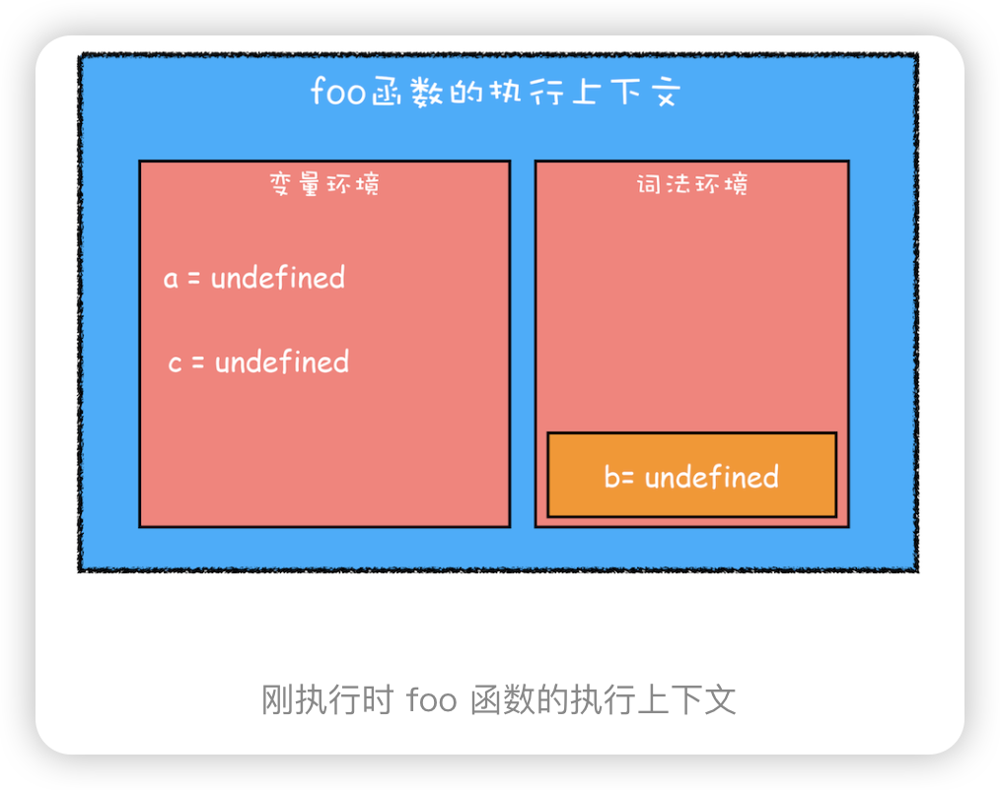
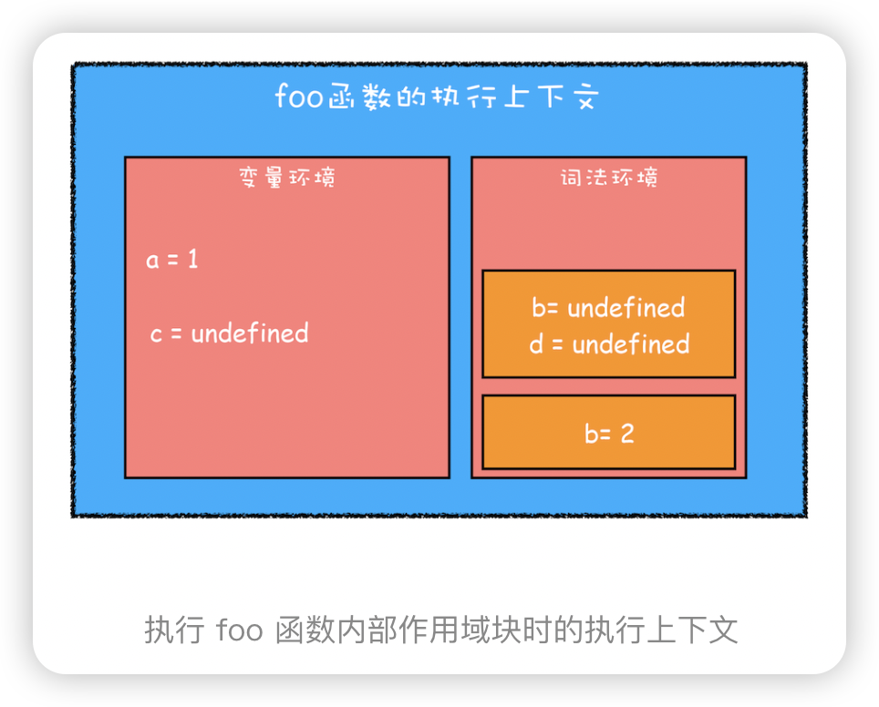
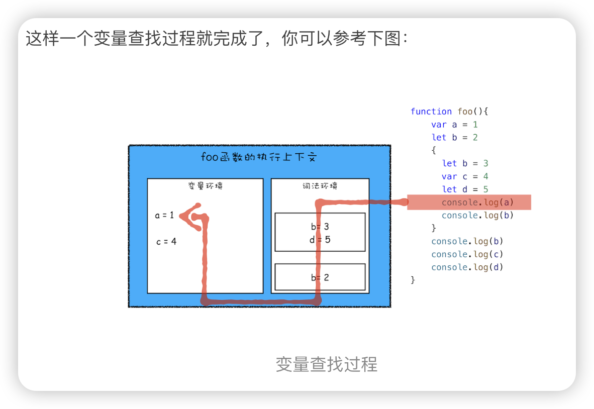

> 问题 js 变量提升、变量污染 等设计缺陷，所以 ES6 引入了块级作用域关键字来解决这些问题。
块级作用域怎么定义？


**作用域（scope）**
作用域是指在程序中定义变量的区域，该位置决定了变量的生命周期。通俗地理解，作用域就是变量与函数的可访问范围，即作用域控制着变量和函数的可见性和生命周期.

在 ES6 之前，ES 的作用域只有两种：全局作用域和函数作用域。
**全局作用域**中的对象在代码中的任何地方都能访问，其生命周期伴随着页面的生命周期。
**函数作用域**就是在函数内部定义的变量或者函数，并且定义的变量或者函数只能在函数内部被访问。函数执行结束之后，函数内部定义的变量会被销毁。
底层原理？


**块级作用域**就是使用一对大括号包裹的一段代码，比如函数、判断语句、循环语句，甚至单独的一个{}都可以被看作是一个块级作用域。

变量提升所带来的问题
1. 变量容易在不被察觉的情况下被覆盖掉
2. 本应销毁的变量没有被销毁

ES6 是如何解决变量提升带来的缺陷
ES6 引入了 let 和 const 关键字，从而使 JavaScript 也能像其他语言一样拥有了块级作用域。
使用 let 关键字声明的变量是可以被改变的，而使用 const 声明的变量其值是不可以被改变的
 那let、const 定义的 变量js 引擎怎么处理呢？JavaScript 是如何支持块级作用域的？
 我们就要站在执行上下文的角度来揭开答案

```js
function foo(){
    var a = 1
    let b = 2
    {
      let b = 3
      var c = 4
      let d = 5
      console.log(a)
      console.log(b)
    }
    console.log(b) 
    console.log(c)
    console.log(d)
}   
foo()
```
 第一步是编译并创建执行上下文，下面是我画出来的执行上下文示意图，你可以参考下：
 
 - 函数内部通过 var 声明的变量，在编译阶段全都被存放到变量环境里面了。
 - 通过 let 声明的变量，在编译阶段会被存放到词法环境（Lexical Environment）中。
 - 在函数内部的作用域块，通过 let 声明的变量并没有被存放到词法环境中。
  
  提示 这里配图有点问题，刚执行foo函数的时候，变量b只是被创建，而并没有被初始化为undefined，这也是在并未执行到 `let b = 2` 语句前面就使用b会抛出 `Cannot access 'x' before initialization` 错误的原因
  
第二步继续执行代码，当执行到代码块里面时，变量环境中 a 的值已经被设置成了 1，词法环境中 b 的值已经被设置成了 2，这时候函数的执行上下文就如下图所示：

从图中可以看出，当进入函数的作用域块时，作用域块中通过 let 声明的变量，会被存放在词法环境的一个单独的区域中，这个区域中的变量并不影响作用域块外面的变量，比如在作用域外面声明了变量 b，在该作用域块内部也声明了变量 b，当执行到作用域内部时，它们都是独立的存在。
【根据 ES 规范（第 8.1 章 Lexical Environments），其实遇到 BlockStatement 时会创建新的词法环境，而非在原词法环境中再创建一个块。 这里老师误解的原因是，LexicalEnvironment 和 Lexical Environment 在规范中指的是两个东西，前者是执行上下文中的组件名，后者是指词法环境这种数据类型本身。 LexicalEnvironment 是一个栈结构，其内部是 Lexical Environment，当执行上下文没有切换时，新创建的词法环境会压入这个栈中，并伴随相关语句的结束弹出销毁。】

顺序执行时，作用域的本质是栈结构的操作
查找定义顺序：先词法环境，后变量环境


```js
let myname= '极客时间'
{
  console.log(myname) 
  let myname= '极客邦'
}
```
【最终打印结果】：VM6277:3 Uncaught ReferenceError: Cannot access 'myname' before initialization
【分析原因】：在块作用域内，let声明的变量被提升，但变量只是创建被提升，初始化并没有被提升，在初始化之前使用变量，就会形成一个暂时性死区。
【拓展】
var的创建和初始化被提升，赋值不会被提升。
let的创建被提升，初始化和赋值不会被提升。
function的创建、初始化和赋值均会被提升。

这里涉及到一个临时性死区（TDZ）的知识； 变量在上下文的存在过程分3个阶段：创建、初始化、赋值；
**创建**：会在环境上下文创建一个该名字的变量，并为其分配内空间； 
**初始化**：将该变量初始化为undefined；
**赋值**：为该变量赋值； 其中，在编译时，会完成创建与初始化，也就是压栈操作； 但是let/const声明的变量只会在环境中创建该变量，并不会进行后面的初始化，在这创建与初始化中间这段时间是无法读取变量的。 这段“时间”叫做临时性死区； 这道题，因为函数内部有myname变量会被提升，但在赋值前就读取，所以会报错