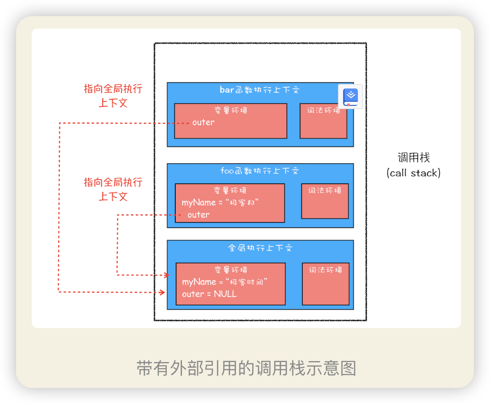
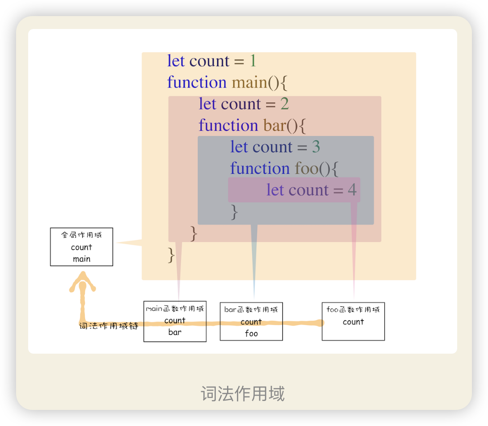

理解作用域链是理解闭包的基础，而闭包在 JavaScript 中几乎无处不在，同时作用域和作用域链还是所有编程语言的基础。所以，如果你想学透一门语言，作用域和作用域链一定是绕不开的

什么是作用域？
其实在每个执行上下文的变量环境中，都包含了一个外部引用，用来指向外部的执行上下文，我们把这个外部引用称为 outer。
当一段代码使用了一个变量时，JavaScript 引擎首先会在“当前的执行上下文”中查找该变量，比如上面那段代码在查找 myName 变量时，如果在当前的变量环境中没有查找到，那么 JavaScript 引擎会继续在 outer 所指向的执行上下文中查找。为了直观理解，你可以看下面这张图：

 
 从图中可以看出，bar 函数和 foo 函数的 outer 都是指向全局上下文的，这也就意味着如果在 bar 函数或者 foo 函数中使用了外部变量，那么 JavaScript 引擎会去全局执行上下文中查找。我们把这个查找的链条就称为**作用域链**。

**法作用域**。这是因为在 JavaScript 执行过程中，其作用域链是由词法作用域决定的。

词法作用域就是指作用域是由代码中函数声明的位置来决定的，所以词法作用域是静态的作用域，通过它就能够预测代码在执行过程中如何查找标识符。

从图中可以看出，词法作用域就是根据代码的位置来决定的，其中 main 函数包含了 bar 函数，bar 函数中包含了 foo 函数，因为 JavaScript 作用域链是由词法作用域决定的，所以整个词法作用域链的顺序是：foo 函数作用域—>bar 函数作用域—>main 函数作用域—> 全局作用域。

 词法作用域是代码编译阶段就决定好的，和函数是怎么调用的没有关系。

 闭包
根据词法作用域的规则，内部函数 getName 和 setName 总是可以访问它们的外部函数 foo 中的变量，