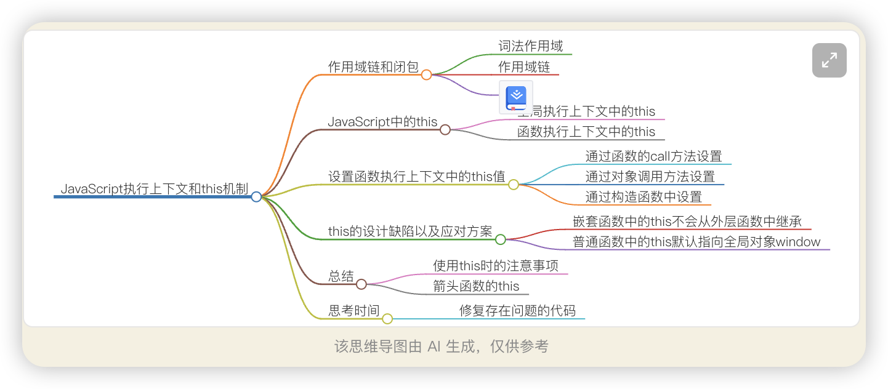
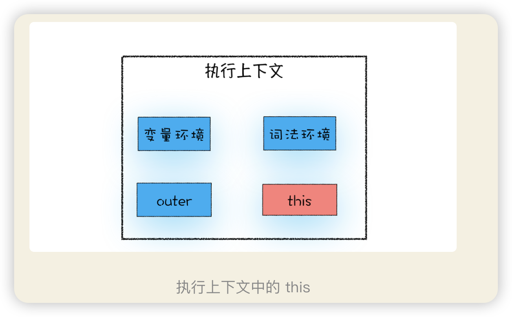

JavaScript 语言的作用域链是由词法作用域决定的，而词法作用域是由代码结构来确定的。

关于 this，我们还是得先从执行上下文说起。执行上下文中包含了:变量环境、词法环境、外部环境，this


从图中可以看出，this 是和执行上下文绑定的，也就是说每个执行上下文中都有一个 this


执行上下文主要分为三种——全局执行上下文、函数执行上下文和 eval 执行上下文，所以对应的 this 也只有这三种——全局执行上下文中的 this、函数中的 this 和 eval 中的 this。


## 全局执行上下文中的 this
在控制台中输入console.log(this)来打印出来全局执行上下文中的 this，最终输出的是 window 对象。所以你可以得出这样一个结论：全局执行上下文中的 this 是指向 window 对象的。这也是 this 和作用域链的唯一交点，作用域链的最底端包含了 window 对象，全局执行上下文中的 this 也是指向 window 对象。


##函数执行上下文中的 this
```js
function foo(){
  console.log(this)
}
foo()
```

那能不能设置执行上下文中的 this 来指向其他对象呢？答案是肯定的。通常情况下，有下面三种方式来设置函数执行上下文中的 this 值

### 1. 通过函数的 call, bind, apply 方法设置
```js
let bar = {
  myName : "极客邦",
  test1 : 1
}
function foo(){
  this.myName = "极客时间"
}
foo.call(bar)
console.log(bar)
console.log(myName)
```
比如下面这段代码，我们就并没有直接调用 foo 函数，而是调用了 foo 的 call 方法，并将 bar 对象作为 call 方法的参数。
使用 bind 和 apply 方法来设置函数执行上下文中的 this，

### 2. 通过对象调用方法设置
```js
var myObj = {
  name : "极客时间", 
  showThis: function(){
    console.log(this)
  }
}
myObj.showThis() // 最终输出的 this 值是指向 myObj 的。

// myObj.showThis.call(myObj)
```

结论：**使用对象来调用其内部的一个方法，该方法的 this 是指向对象本身的。**

结论：
在全局环境中调用一个函数，函数内部的 this 指向的是全局变量window。
通过一个对象来调用其内部的一个方法，该方法的执行上下文中的 this 指向对象本身。

### 3. 通过构造函数中设置
```js
function CreateObj(){
  this.name = "极客时间"
}
var myObj = new CreateObj()
```
JavaScript 引擎做了如下四件事：
- 首先创建了一个空对象 tempObj；
- 接着调用 CreateObj.call 方法，并将 tempObj 作为 call 方法的参数，这样当 CreateObj 的执行上下文创建时，它的 this 就指向了 tempObj 对象；
- 然后执行 CreateObj 函数，此时的 CreateObj 函数执行上下文中的 this 指向了 tempObj 对象；
- 最后返回 tempObj 对象。


## this 的设计缺陷以及应对方案

### 1. 嵌套函数中的 this 不会从外层函数中继承
```js
var myObj = {
  name : "极客时间", 
  showThis: function(){
    console.log(this)
    function bar(){console.log(this)}
    bar()
  }
}
myObj.showThis()
```

解决
解决1 比如在 showThis 函数中声明一个变量 self 用来保存 this，
```js
var myObj = {
  name : "极客时间", 
  showThis: function(){
    console.log(this)
    var self = this
    function bar(){
      self.name = "极客邦"
    }
    bar()
  }
}
myObj.showThis()
console.log(myObj.name)
console.log(window.name)
```
本质是把 this 体系转换为了作用域的体系。

解决2 你也可以使用 ES6 中的箭头函数来解决这个问题
```js
var myObj = {
  name : "极客时间", 
  showThis: function(){
    console.log(this)
    var bar = ()=>{
      this.name = "极客邦"
      console.log(this)
    }
    bar()
  }
}
myObj.showThis()
console.log(myObj.name)
console.log(window.name)
```


### 2. 普通函数中的 this 默认指向全局对象 window


思考
```js
let userInfo = {
  name:"jack.ma",
  age:13,
  sex:male,
  updateInfo:function(){
    //模拟xmlhttprequest请求延时
    setTimeout(function(){
      this.name = "pony.ma"
      this.age = 39
      this.sex = female
    },100)
  }
}

userInfo.updateInfo()
```
我想通过 updateInfo 来更新 userInfo 里面的数据信息，但是这段代码存在一些问题，你能修复这段代码吗？
改进
```js
修改方法一：箭头函数最方便
let userInfo = {
  name:"jack.ma",
  age:13,
  sex:'male',
  updateInfo:function(){
    // 模拟 xmlhttprequest 请求延时
    setTimeout(() => {
      this.name = "pony.ma"
      this.age = 39
      this.sex = 'female'
    },100)
  }
}

userInfo.updateInfo()
setTimeout(() => {
  console.log(userInfo)
},200)

// 修改方法二：缓存外部的this
let userInfo = {
  name:"jack.ma",
  age:13,
  sex:'male',
  updateInfo:function(){
    let me = this; // ----
    // 模拟 xmlhttprequest 请求延时
    setTimeout(function() {
      me.name = "pony.ma"
      me.age = 39
      me.sex = 'female'
    },100)
  }
}

userInfo.updateInfo()
setTimeout(() => {
  console.log(userInfo);
},200)

// 修改方法三，其实和方法二的思路是相同的
let userInfo = {
  name:"jack.ma",
  age:13,
  sex:'male',
  updateInfo:function(){
    // 模拟 xmlhttprequest 请求延时
    void function(me) {
      setTimeout(function() {
        me.name = "pony.ma"
        me.age = 39
        me.sex = 'female'
      },100)
    }(this); // 参数----
  }
}

userInfo.updateInfo()
setTimeout(() => {
  console.log(userInfo)
},200)

let update = function() {
  this.name = "pony.ma"
  this.age = 39
  this.sex = 'female'
}

// 方法四: 利用call或apply修改函数被调用时的this值(不知掉这么描述正不正确)
let userInfo = {
  name:"jack.ma",
  age:13,
  sex:'male',
  updateInfo:function(){
    // 模拟 xmlhttprequest 请求延时
    setTimeout(function() {
      update.call(userInfo);
      // update.apply(userInfo)
    }, 100)
  }
}

userInfo.updateInfo()
setTimeout(() => {
  console.log(userInfo)
},200)

// 方法五: 利用bind返回一个新函数，新函数被调用时的this指定为userInfo
let userInfo = {
  name:"jack.ma",
  age:13,
  sex:'male',
  update: function() {
    this.name = "pony.ma"
    this.age = 39
    this.sex = 'female'
  },
  updateInfo:function(){
    // 模拟 xmlhttprequest 请求延时
    setTimeout(this.update.bind(this), 100)
  }
}
```
1. 箭头函数 
2. 缓存上下文（self、自执行函数） 
3. 显示绑定上下文（call, apply, bind） 
4. setTimeout第三个参数传入（其实也相当于缓存了上下文）
这五个方法就是在改this，或者我们手写的“call" 为函数的原型,叫做changeThis，然后调用函数的时候是通过调用原型函数上的这个changeThis 来执行函数。说白了，都是在改this