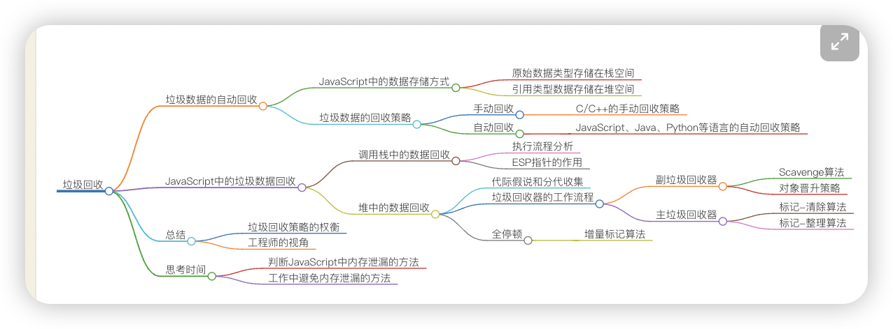
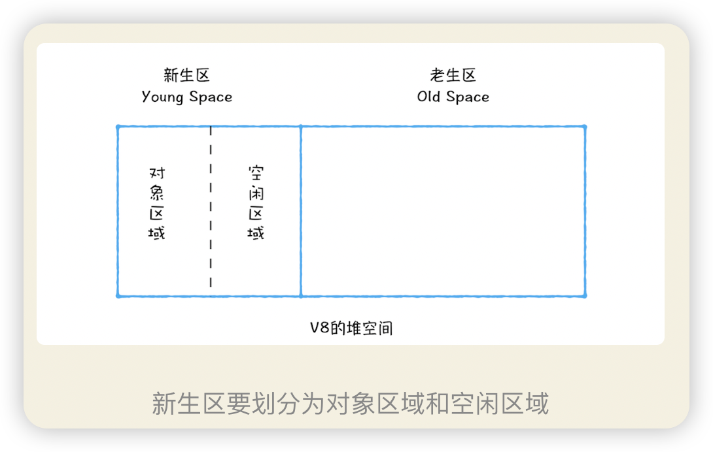
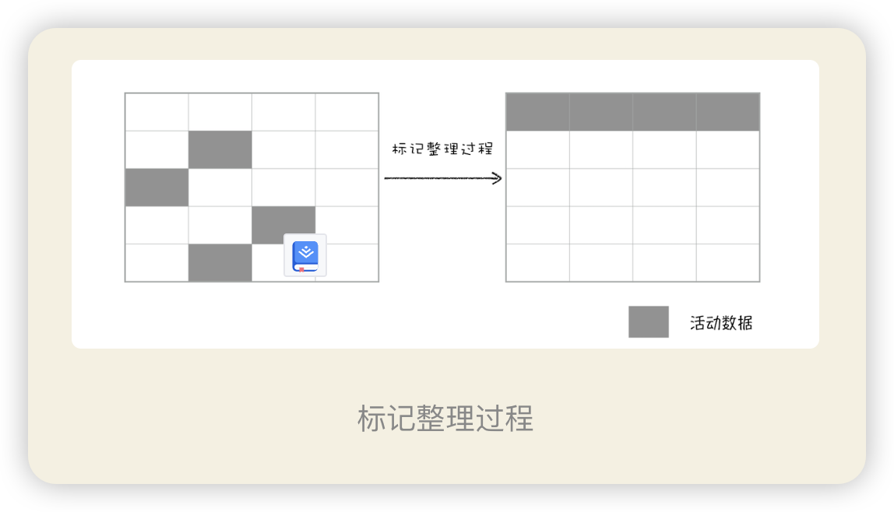
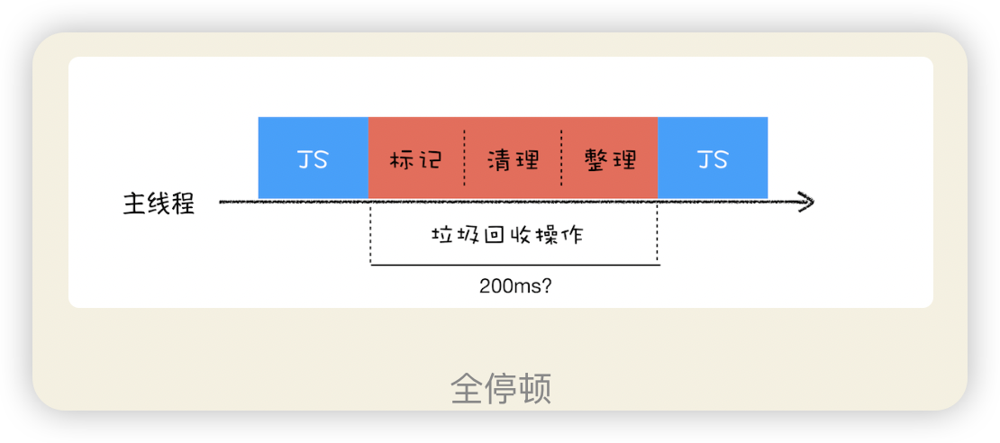
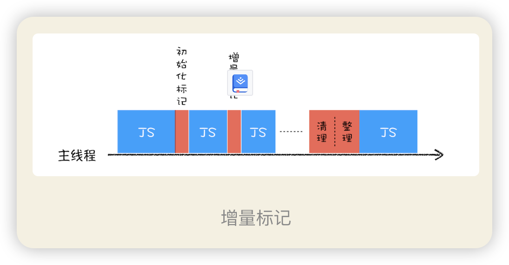

## 调用栈中的数据如何回收？

当一个函数执行结束之后，JavaScript 引擎会通过向下移动 ESP 来销毁该函数保存在栈中的执行上下文。

## 堆中数据如何回收？
**代际假说**和**分代收集**

代际假说有以下两个特点：
- 第一个是大部分对象在内存中存在的时间很短，简单来说，就是很多对象一经分配内存，很快就变得不可访问；
- 第二个是不死的对象，会活得更久。

在 V8 中会把堆分为新生代和老生代两个区域，
**新生代**：中存放的是生存时间短的对象，
**老生代**： 中存放的生存时间久的对象

副垃圾回收器，主要负责新生代的垃圾回收。
主垃圾回收器，主要负责老生代的垃圾回收。

## 垃圾回收工作流程
- 第一步是**标记**空间中活动对象和非活动对象。所谓活动对象就是还在使用的对象，非活动对象就是可以进行垃圾回收的对象。
- 第二步是**回收**非活动对象所占据的内存。其实就是在所有的标记完成之后，统一清理内存中所有被标记为可回收的对象。
- 第三步是做**内存整理**。一般来说，频繁回收对象后，内存中就会存在大量不连续空间，我们把这些不连续的内存空间称为内存碎片。当内存中出现了大量的内存碎片之后，如果需要分配较大连续内存的时候，就有可能出现内存不足的情况。所以最后一步需要整理这些内存碎片，但这步其实是可选的，因为有的垃圾回收器不会产生内存碎片，比如接下来我们要介绍的副垃圾回收器。

### 副垃圾回收器

新加入的对象都会存放到对象区域，当对象区域快被写满时，就需要执行一次垃圾清理操作。过程：
- 标记
- 清理+整理   存活的对象赋值到空闲区域，同时把这些对象进行排列
- 角色反转： 对象区域和空闲区域互换，作用：同时这种角色翻转的操作还能让新生代中的这两块区域无限重复使用下去。
算法： 新生代中用 Scavenge 算法来处理。所谓 Scavenge 算法，是把新生代空间对半划分为两个区域，一半是对象区域，一半是空闲区域，如下图所示：

缺陷：新生区 空间不大， 很容易被存活的对象填满
解决： 对象晋升策略：也就是经过两次垃圾回收依然还存活的对象，会被移动到老生区中。
### 主垃圾回收
主要负责老生区中的垃圾回收。除了新生区中晋升的对象，一些大的对象会直接被分配到老生区。
老生区中的对象有两个特点，一个是对象占用空间大，另一个是对象存活时间长。
**算法：**
- 主垃圾回收器是采用**标记 - 清除（Mark-Sweep）**的算法进行垃圾回收的
  过程：首先是标记过程阶段。标记阶段就是从一组根元素开始，递归遍历这组根元素，在这个遍历过程中，能到达的元素称为活动对象，没有到达的元素就可以判断为垃圾数据。
  接下来就是垃圾的清除过程。它和副垃圾回收器的垃圾清除过程完全不同，你可以理解这个过程是清除掉红色标记数据的过程，可参考下图大致理解下其清除过程：
- **标记 - 整理（Mark-Compact）**
  标记过程仍然与标记 - 清除算法里的是一样的，但后续步骤不是直接对可回收对象进行清理，而是让所有存活的对象都向一端移动，然后直接清理掉端边界以外的内存。你可以参考下图：

**全停顿**
V8 是使用副垃圾回收器和主垃圾回收器处理垃圾回收的，不过由于 JavaScript 是运行在主线程之上的，一旦执行垃圾回收算法，都需要将正在执行的 JavaScript 脚本暂停下来，待垃圾回收完毕后再恢复脚本执行。我们把这种行为叫**做全停顿**（Stop-The-World）。

在 V8 新生代的垃圾回收中，因其空间较小，且存活对象较少，所以全停顿的影响不大，
但老生代就不一样了。如果在执行垃圾回收的过程中，占用主线程时间过久，就像上面图片展示的那样，花费了 200 毫秒，在这 200 毫秒内，主线程是不能做其他事情的。比如页面正在执行一个 JavaScript 动画，因为垃圾回收器在工作，就会导致这个动画在这 200 毫秒内无法执行的，这将会造成页面的卡顿现象。**老生代 执行垃圾回收的过程 卡顿**

为了降低老生代的垃圾回收而造成的卡顿，V8 将标记过程分为一个个的子标记过程，同时让垃圾回收标记和 JavaScript 应用逻辑交替进行，直到标记阶段完成，我们把这个算法称为增量标记（Incremental Marking）算法。如下图所示：
