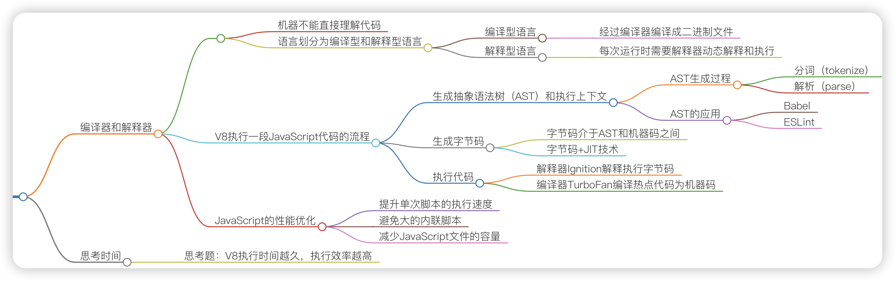
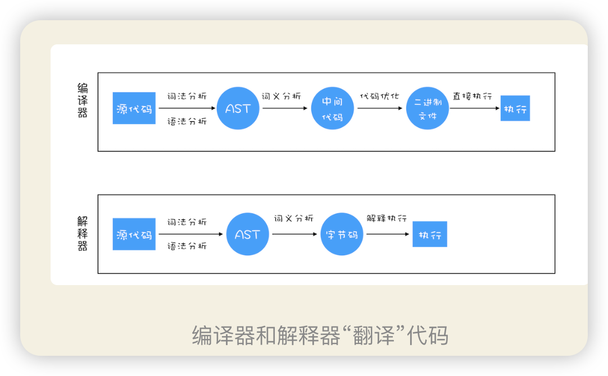
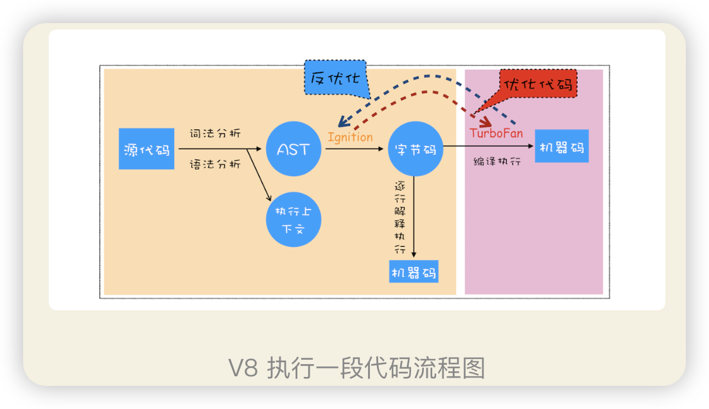
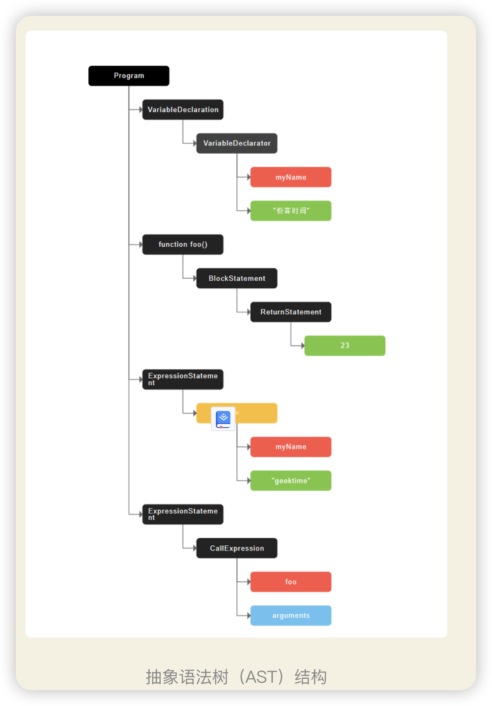
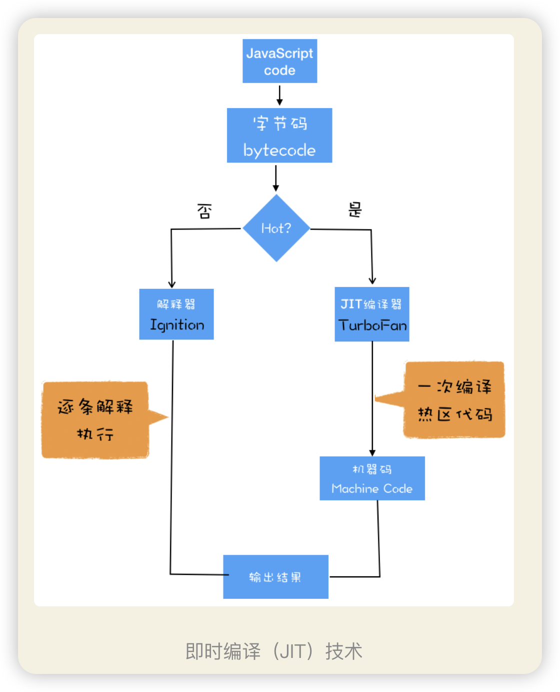

> 要深入理解 V8 的工作原理，你需要搞清楚一些概念和原理，比如接下来我们要详细讲解的编译器（Compiler）、解释器（Interpreter）、抽象语法树（AST）、字节码（Bytecode）、即时编译器（JIT）等概念

## 编译器和解释器
原因：是因为机器不能直接理解我们所写的代码，所以在执行程序之前，需要将我们所写的代码“翻译”成机器能读懂的机器语言。
按语言的执行流程，可以把语言划分为编译型语言和解释型语言。
**编译型语言**在程序执行之前，需要经过编译器的编译过程，并且编译之后会直接保留机器能读懂的二进制文件，这样每次运行程序时，都可以直接运行该二进制文件，而不需要再次重新编译了。比如 C/C++、GO 等都是编译型语言。
**解释型语言**编写的程序，在每次运行时都需要通过解释器对程序进行动态解释和执行。比如 Python、JavaScript 等都属于解释型语言。

二者的执行流程

1. 在编译型语言的编译过程中，
   编译器首先会依次对源代码进行词法分析、语法分析，生成抽象语法树（AST）：编译器或者解释器后续的工作都需要依赖于 AST，而不是源代码。，
   然后是优化代码，
   最后再生成处理器能够理解的机器码。
   如果编译成功，将会生成一个可执行的文件。
   但如果编译过程发生了语法或者其他的错误，那么编译器就会抛出异常，最后的二进制文件也不会生成成功。
2. 在解释型语言的解释过程中，同样解释器也会对源代码进行词法分析、语法分析，并生成抽
   象语法树（AST），不过它会再基于抽象语法树生成字节码，最后再根据字节码来执行程序、输出结果。
   **应用**
   AST 是非常重要的一种数据结构，在很多项目中有着广泛的应用。其中最著名的一个项目是 Babel。Babel 是一个被广泛使用的代码转码器，可以将 ES6 代码转为 ES5 代码，这意味着你可以现在就用 ES6 编写程序，而不用担心现有环境是否支持 ES6。Babel 的工作原理就是先将 ES6 源码转换为 AST，然后再将 ES6 语法的 AST 转换为 ES5 语法的 AST，最后利用 ES5 的 AST 生成 JavaScript 源代码。
   ESLint 是一个用来检查 JavaScript 编写规范的插件，其检测流程也是需要将源码转换为 AST，然后再利用 AST 来检查代码规范化的问题。
**疑惑**
那接下来我们再来看下 AST 是如何生成的？。通常，生成 AST 需要经过两个阶段。
**第一阶段是分词（tokenize），又称为词法分析**
其作用是将一行行的源码拆解成一个个 token。所谓 token，指的是语法上不可能再分的、最小的单个字符或字符串。

**第二阶段是解析（parse），又称为语法分析**
第二阶段是解析（parse），又称为语法分析，其作用是将上一步生成的 token 数据，根据语法规则转为 AST。如果源码符合语法规则，这一步就会顺利完成。但如果源码存在语法错误，这一步就会终止，并抛出一个“语法错误”。

##  V8 是如何执行一段 JavaScript 代码的

1. 生成抽象语法树（AST）和执行上下文
   将源代码转换为：
   抽象语法树【AST】，
   并生成执行上下文：执行上下文我们在前面的文章中已经介绍过很多了，主要是代码在执行过程中的环境信息。
   **抽象语法树【AST】**
   高级语言是开发者可以理解的语言，对编译器或者解释器来理解就非常困难了。对于编译器或者解释器来说，它们可以理解的就是 AST 了。所以无论你使用的是解释型语言还是编译型语言，在编译过程中，它们都会生成一个 AST。这和渲染引擎将 HTML 格式文件转换为计算机可以理解的 DOM 树的情况类似。
   
2. 生成字节码
   解释器 Ignition 就登场了，它会根据 AST 生成字节码，并解释执行字节码。
   **那什么是字节码呢？**为什么引入字节码就能解决内存占用问题呢？字节码就是介于 AST 和机器码之间的一种代码。但是与特定类型的机器码无关，字节码需要通过解释器将其转换为机器码后才能执行。
  
3. 执行代码
   
    **解释器 Ignition** 除了负责生成字节码之外，它还有另外一个作用，就是解释执行字节码。
    比如一段代码被重复执行多次，这种就称为**热点代码**，
    后台的编译器 TurboFan 就会把该段热点的字节码编译为高效的机器码，然后当再次执行这段被优化的代码时，只需要执行编译后的机器码就可以了，这样就大大提升了代码的执行效率。
## JavaScript 的性能优化
优化 JavaScript 执行效率，你应该将优化的中心聚焦在单次脚本的执行时间和脚本的网络下载上，
1. 提升单次脚本的执行速度，避免 JavaScript 的长任务霸占主线程，这样可以使得页面快速响应交互；
2. 避免大的内联脚本，因为在解析 HTML 的过程中，解析和编译也会占用主线程；
3. 减少 JavaScript 文件的容量，因为更小的文件会提升下载速度，并且占用更低的内存。