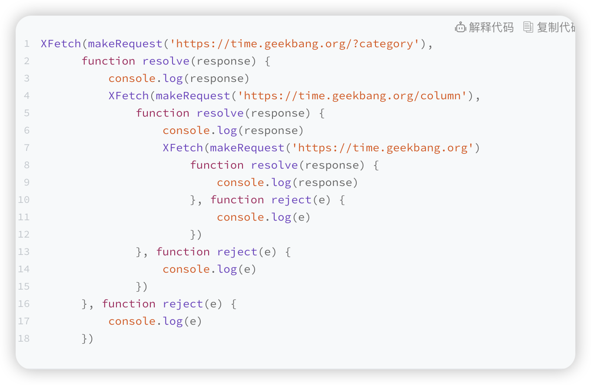

>微任务的另外一个应用 Promise

如何诞生的，
Promise 到底解决了什么问题呢？
**问题**：异步编程的问题：代码逻辑不连续

Web 页面的单线程架构决定了异步回调，而异步回调影响到了我们的编码方式，到底是如何影响的呢？
多个的回调会导致代码的逻辑不连贯、不线性，非常不符合人的直觉，这就是异步回调影响到我们的编码方式。

**封装异步代码，让处理流程变得线性**
重点关注的是输入内容（请求信息）和输出内容（回复信息）

**新的问题**：回调地狱

代码乱，归结其原因有两点：
- 第一是嵌套调用，下面的任务依赖上个任务的请求结果，并在上个任务的回调函数内部执行新的业务逻辑，这样当嵌套层次多了之后，代码的可读性就变得非常差了。
- 第二是任务的不确定性，执行每个任务都有两种可能的结果（成功或者失败），所以体现在代码中就需要对每个任务的执行结果做两次判断，这种对每个任务都要进行一次额外的错误处理的方式，明显增加了代码的混乱程度。

**第一是消灭嵌套调用**；
**第二是合并多个任务的错误处理**。

Promise 已经帮助我们解决了这两个问题。那么接下来我们就来看看 Promise 是怎么消灭嵌套调用和合并多个任务的错误处理的。

**Promise：消灭嵌套调用和多次错误处理**

Promise 主要通过下面两步**解决嵌套回调问题**的。
首先，Promise 实现了回调函数的延时绑定
其次，需要将回调函数 onResolve 的返回值穿透到最外层
现在我们知道了 Promise 通过**回调函数延迟绑定**和**回调函数返回值穿透**的技术，解决了循环嵌套。


Promise 是怎么处理异常的？
因为 Promise 对象的错误具有“冒泡”性质，会一直向后传递，直到被 onReject 函数处理或 catch 语句捕获为止。具备了这样“冒泡”的特性后，就不需要在每个 Promise 对象中单独捕获异常了


## Promise 与微任务
Promise 和微任务的关系到底体现哪里呢？
```js
    function executor(resolve, reject) {
        resolve(100)
    }
    let demo = new Promise(executor)

    function onResolve(value){
        console.log(value)
    }
    demo.then(onResolve)
```

总结
产生回调地狱的原因：
1. 多层嵌套的问题；
2. 每种任务的处理结果存在两种可能性（成功或失败），那么需要在每种任务执行结束后分别处理这两种可能性。


**思考**

Promise 中为什么要引入微任务？
Promise 中是如何实现回调函数返回值穿透的？
Promise 出错后，是怎么通过“冒泡”传递给最后那个捕获异常的函数？