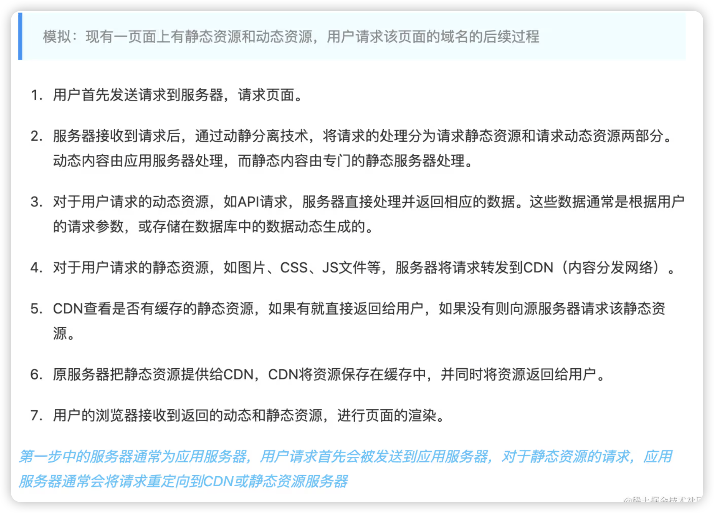

## 什么是动静分离？
动静分离是一种在Web服务器架构中常用的优化技术，旨在提高网站的性能和可伸缩性。它基于一个简单的原则：将动态生成的内容（如动态网页、API请求）与静态资源（如HTML、CSS、JavaScript、图像文件）分开处理和分发。
通过将动态内容和静态资源存储在不同的服务器或服务上，并使用不同的处理机制，可以提高网站的处理效率和响应速度。这种分离的好处包括：

性能优化：将静态资源与动态内容分离可以提高网站的加载速度。由于静态资源往往是不变的，可以使用缓存机制将其存储在CDN（内容分发网络）或浏览器缓存中，从而减少网络请求和数据传输的开销。
负载均衡：通过将动态请求分发到不同的服务器或服务上，可以平衡服务器的负载，提高整个系统的可伸缩性和容错性。
安全性：将动态请求与静态资源分开处理可以提高系统的安全性。静态资源通常是公开可访问的，而动态请求可能涉及敏感数据或需要特定的身份验证和授权。通过将静态资源与动态内容分离，可以更好地管理访问控制和安全策略。

### 实现动静分离的方法

使用反向代理服务器（如Nginx、Apache）将静态请求和动态请求转发到不同的后端服务器或服务。
将静态资源部署到CDN上，通过CDN分发静态资源，减轻源服务器的负载。
使用专门的静态文件服务器（如Amazon S3、Google Cloud Storage）存储和提供静态资源，而将动态请求交给应用服务器处理。

使用的node 库
```sh
   npm install mime
```

> 因为每个文件所对应的mime类型都不一样，如果手写的话有很多，不过强大的nodejs社区提供了mime库，可以帮我们通过后缀直接分析出 所对应的mime类型，然后我们通过强缓存让浏览器缓存静态资源
**常见的mime类型展示**

```txt
-   文本文件：

    -   text/plain：纯文本文件
    -   text/html：HTML 文件
    -   text/css：CSS 样式表文件
    -   text/javascript：JavaScript 文件
    -   application/json：JSON 数据

-   图像文件：

    -   image/jpeg：JPEG 图像
    -   image/png：PNG 图像
    -   image/gif：GIF 图像
    -   image/svg+xml：SVG 图像

-   音频文件：

    -   audio/mpeg：MPEG 音频
    -   audio/wav：WAV 音频
    -   audio/midi：MIDI 音频

-   视频文件：

    -   video/mp4：MP4 视频
    -   video/mpeg：MPEG 视频
    -   video/quicktime：QuickTime 视频

-   应用程序文件：

    -   application/pdf：PDF 文件
    -   application/zip：ZIP 压缩文件
    -   application/x-www-form-urlencoded：表单提交数据
    -   multipart/form-data：多部分表单数据

```


## 验证
验证访问静态文件
```sh
cd 当前目录
node index.js
```

在浏览器打开：
http://localhost/static/index.css
http://localhost/static/index.html
http://localhost/static/node.png

### 思路2

