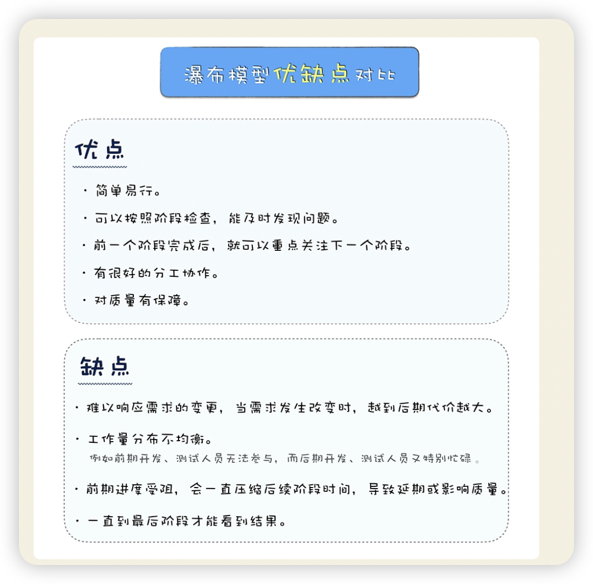

就是要用工程化方法去规范软件开发，让项目可以**按时完成**、**成本可控**、**质量有保证**。
软件工程的知识，都是建立在软件项目的过程，或者说软件项目生命周期之上的。
基于软件过程，我们有了角色分工，有了对过程的管理和工具，对过程中每个阶段细分的方法学和工具。

总结： 
软件工程 = 过程 + 方法 + 工具；
核心： 围绕软件项目开发，对过程的组织，对方法运用，对工具使用

## 工程思维
阶段： 分析、设计、实施、测试、完成

**工程方法**
有目的、有计划、有步骤 地解决问题的方法
工程方法通常会分成六个阶段：想法、概念、计划、设计、开发和发布
好处：
- 被论证过的经验知指导你， 提高成功概率、提高效率；
- 大局观思考，看问题

## 瀑布模型
现代软件工程起源
因为不管什么软件项目，不管采用什么开发模式，有四种活动是必不可少的，那就是**需求**、**设计**、**编码**和**测试**。而这四项活动，都是起源自瀑布模型，也是瀑布模型中核心的部分。
优点：
缺点：

## 其他开发模型
暂停在此 2024/04/28